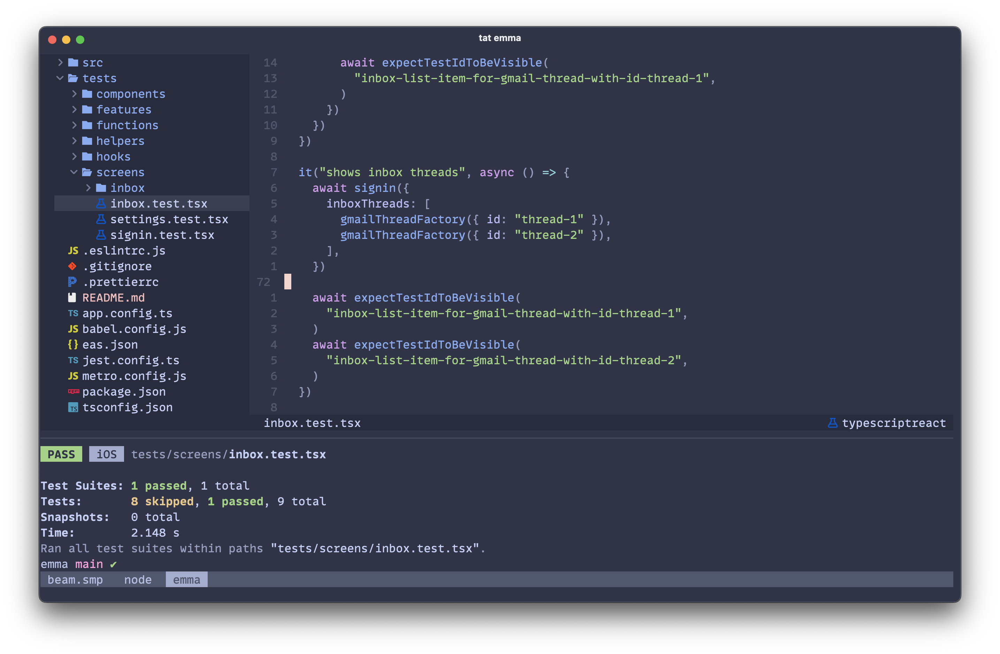

# 👻 Boo

_The lazy ghost_.



Boo is a set of steps that I use to set up new or re-imaged Mac machines. It includes manual and automated steps to configure my system settings, install my apps and setup my terminal ([Ghostty](https://ghostty.org)). My dotfiles are also installed, which mainly configure [Neovim](https://neovim.io) and some [Lazy.nvim](https://lazy.folke.io/) plugins.

[Install Xcode](https://apps.apple.com/us/app/xcode/id497799835)

[Install Amphetamine](https://apps.apple.com/us/app/amphetamine/id937984704)

[Install Bear](https://apps.apple.com/us/app/bear-markdown-notes/id1091189122)

[Install ColorSlurp](https://apps.apple.com/us/app/colorslurp/id1287239339)

[Install Affinity Photo](https://apps.apple.com/us/app/affinity-photo-2-image-editor/id1616822987)

[Install the MonoLisa font](https://github.com/pachun/boo/tree/main/assets/MonoLisa)

[Set your desktop wallpaper](https://github.com/pachun/boo/blob/main/assets/less%20is%20less.png)

## System Settings

- Trackpad → Tracking Speed → Move the slider all the way to the right
- Trackpad → Tap to Click → On
- Keyboard → Keyboard Shortcuts → Modifier Keys → Caps Lock → Control
- Desktop & Dock → Automatically hide and show the Dock → On
- Desktop & Dock → Desktop & Stage Manager → Click wallpaper to reveal desktop → Only in Stage Manager
- Desktop & Dock → Desktop & Stage Manager → Show Items → On Desktop → Off
- Control Center → Battery → Show Percentage → On
- Accessibility → Pointer Control → Trackpad Options → Use trackpad for dragging → On (Without Drag Lock)

## Finder Settings

- Remove all but Finder and Trash from the dock.
- `⌘ ,` → General → New Finder windows show → `~`
- `⌘ ,` → Sidebar → **only** `~`, `icloud documents`, and `Applications`
- `⌘ n` → Click "View as List" → `⌘ j` → Always open in list view → On → Use as Defaults

## Safari Settings

- `⌘ ,` → Advanced → Show features for web developers → On

## iPhone Settings

- Settings → Apps → Messages → Text Message Forwarding → New Machine's Name → On

## GitHub Setup

[Generate an SSH key](https://docs.github.com/en/authentication/connecting-to-github-with-ssh/generating-a-new-ssh-key-and-adding-it-to-the-ssh-agent) and [add it to GitHub](https://docs.github.com/en/authentication/connecting-to-github-with-ssh/adding-a-new-ssh-key-to-your-github-account).

## After Xcode is installed

Install [homebrew](https://brew.sh/), install [applications](https://github.com/pachun/boo/blob/main/Brewfile), and symlink [dotfiles](https://github.com/pachun/boo/blob/main/dotfiles) by running:

```sh
mkdir code && cd code && git clone git@github.com:pachun/boo.git && cd boo && ./install.sh
```

You'll eventually be prompted to enter the name and email you want to be shown on your git commits.

After that finishes, start postgres.

```sh
brew services start postgresql@17
```

## Making changes

- [Add a dotfile](https://github.com/pachun/boo/tree/main/dotfiles) (without the dot prefix), [remove your dotfile from gitignore](https://github.com/pachun/boo/blob/main/.gitignore) and run `./dotfiles.sh`
- [Add a Homebrew app](https://github.com/pachun/boo/blob/main/Brewfile) and run `brew bundle`
- Add or edit a Neovim lazy.nvim plugin ([existing plugins](https://github.com/pachun/boo/tree/main/dotfiles/config/nvim/lua/plugins)): `lplug plugin-name` (e.g. `lplug telescope`)
- [Change your Ghostty & Neovim themes](https://github.com/pachun/boo/blob/main/dotfiles/config/theme)
- [Add a Neovim keymap](https://github.com/pachun/boo/blob/main/dotfiles/config/nvim/lua/config/personal/keymaps.lua)
- [Add a Neovim option](https://github.com/pachun/boo/blob/main/dotfiles/config/nvim/lua/config/personal/opts.lua)
- [Add a Neovim syntax highlighter](https://github.com/pachun/boo/blob/main/dotfiles/config/nvim/lua/config/personal/syntax_highlighters.lua)
- [Add a Neovim language server](https://github.com/pachun/boo/blob/main/dotfiles/config/nvim/lua/config/personal/language_servers.lua)
- [Add a Neovim formatter](https://github.com/pachun/boo/blob/main/dotfiles/config/nvim/lua/config/personal/formatters.lua)
- [Add a Neovim linter](https://github.com/pachun/boo/blob/main/dotfiles/config/nvim/lua/config/personal/linters.lua)

## License

In case anyone comes across this and likes it enough to want it, [please take whatever you want](https://github.com/pachun/boo/blob/main/LICENSE).
